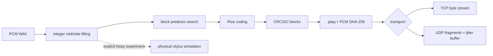

# PLAQ

PLAQ is an experimental, open-source lossless audio codec that treats mono or
stereo PCM as a virtual stylus trajectory. It applies a reversible integer
mid/side lifting transform, selects the smallest measured block predictor/Rice
encoding, and stores independently verifiable blocks in `.plaq` files.

The research question is deliberately falsifiable: does trajectory continuity
and stereo correlation expose useful residual structure? PLAQ is already useful
when the answer is “not for this signal,” because it provides a bit-perfect
implementation, a documented format, and reproducible negative results.

## What it is / what it is not

PLAQ is:

- A working lossless prototype for mono/stereo 16-bit and 24-bit integer PCM WAV.
- A small versioned container with block CRC32C and whole-PCM SHA-256.
- A predictor/Rice experiment with inspectable per-block choices.
- A transport-independent `.plaq` stream with TCP and UDP demonstrations.
- An optional, separately invoked lossy physical-stylus simulation.

PLAQ is not a way to recover information beyond the digital source, “more
lossless than lossless,” or guaranteed to beat FLAC. Digitized motion still
requires sampling and quantization. The physical simulation is not part of the
lossless codec path.



## Quick start

Requires Rust 1.87 or newer. Python 3 with NumPy and Matplotlib is needed only
for visualization.

```bash
git clone https://github.com/AybarsBarut/PLAQ.git plaq-codec
cd plaq-codec
cargo build --release -p plaq-cli

target/release/plaq encode input.wav output.plaq
target/release/plaq inspect output.plaq
target/release/plaq verify input.wav output.plaq
target/release/plaq decode output.plaq restored.wav
```

On Windows the binary is `target\release\plaq.exe`. To install it in Cargo's
binary directory:

```bash
cargo install --path crates/plaq-cli
```

## Lossless verification

The encoder hashes canonical interleaved PCM bytes and writes SHA-256 into the
file header. Every decode validates each compressed block's CRC32C, reconstructs
integer samples, and validates the final hash before returning output. `verify`
also compares source metadata and samples to the decoded result:

```bash
plaq verify input.wav output.plaq
# bit-perfect: yes; PCM SHA-256 ...; checksums verified: ...
```

RIFF metadata does not round-trip byte-for-byte. Sample rate, channel count, bit
depth, frame count, and PCM values do.

## Commands

```bash
plaq encode input.wav output.plaq [--block-frames 4096]
plaq decode input.plaq output.wav
plaq verify input.wav output.plaq
plaq inspect input.plaq [--json]
plaq benchmark input.wav --compare wav,flac [--json]
plaq visualize input.wav --out groove.png

# Explicitly lossy and separate from encode/decode:
plaq simulate input.wav stylus.wav --mass 0.02 --compliance 0.8 --damping 0.15

# TCP sender listens; receiver connects:
plaq stream-send input.plaq --transport tcp --bind 0.0.0.0:7310
plaq stream-recv output.plaq --transport tcp --connect 127.0.0.1:7310

# UDP receiver listens before sender starts:
plaq stream-recv output.plaq --transport udp --bind 0.0.0.0:7311
plaq stream-send input.plaq --transport udp --target 127.0.0.1:7311
```

UDP never invents replacement samples. An incomplete block times out with an
error and no output file. XOR or Reed–Solomon recovery is not implemented in
version 1; the reported recovered-packet count therefore remains zero.

## Format and architecture

The Rust workspace separates the reversible primitives, container, transport,
and user interface:

| Crate | Responsibility |
|---|---|
| `plaq-core` | integer lifting, raw/delta/linear/cubic/cross-axis predictors, Rice coding, isolated lossy simulation |
| `plaq-format` | bounded v1 reader/writer, TLV metadata, CRC32C and SHA-256 |
| `plaq-stream` | packet header, fragmentation, jitter/reorder buffer, TCP/UDP demos |
| `plaq-cli` | WAV I/O, commands, benchmark and tool orchestration |

See [FORMAT](docs/FORMAT.md), [THEORY](docs/THEORY.md),
[STREAMING](docs/STREAMING.md), and [ADR-0001](docs/ADR-0001.md).

## Current measured result

This is a single deterministic synthetic smoke signal, not a music-corpus
claim. It combines correlated tones, diverging chirps, noise, and impulses.
Environment and exact commands are in [EXPERIMENTS](docs/EXPERIMENTS.md).

| Input | PCM bytes | PLAQ bytes | PLAQ/PCM | FLAC | Encode | Decode | Bit-perfect |
|---|---:|---:|---:|---:|---:|---:|:---:|
| 2 s, stereo, 48 kHz, 16-bit synthetic | 384000 | 244072 | 0.6356 | N/A¹ | 4.63 MiB/s | 55.88 MiB/s | yes |

¹ The measurement host did not have a `flac` executable. The CLI reports this
as unavailable rather than fabricating a comparison. On this input PLAQ reduced
canonical PCM by 36.44%; no general advantage over another codec is implied.

The localhost UDP smoke run transferred the same 244072-byte file in 209 packets
with zero measured loss, recovery, or underruns and 3.623 ms measured end-to-end
latency. The source, TCP output, and UDP output shared file SHA-256
`2ac56cce6728af6fcbea33c3e7910bb0cee079dff60a73a3f5376fe81e1598ce`.

## Reproduce the experiment

```bash
python tools/generate_synthetic.py target/experiment.wav --seconds 2
cargo run --release -p plaq-cli -- benchmark target/experiment.wav --compare wav,flac --json
cargo run --release -p plaq-cli -- visualize target/experiment.wav --out target/groove.png
```

`tools/analyze.py` converts one or more saved JSON benchmark reports into a
Markdown comparison table.

## Tests

PLAQ does not require hosted CI. One local command runs the complete quality
gate:

```bash
python tools/check.py
```

Optionally make it automatic before every `git push`:

```bash
git config core.hooksPath .githooks
```

Tests cover silence, impulse, sweep, white/pink noise, very low and maximum
amplitudes; mono/stereo, 16/24-bit, multiple sample rates; randomized reversible
transforms; short/empty/block-boundary cases; corrupt/truncated containers; and
reordered, duplicated, missing, delayed, or corrupted UDP fragments. Two
`cargo-fuzz` targets live under `fuzz/`.

## Limitations and research direction

The current implementation buffers a bounded whole file, performs exhaustive
predictor search, has no UDP retransmission/FEC/security, and supports a narrow
PCM input set. The physical model omits RIAA, wow/flutter, surface noise, and
tracing distortion. See [LIMITATIONS](docs/LIMITATIONS.md) and
[ROADMAP](docs/ROADMAP.md).

Interesting next tests include cross-axis predictor variants, alternative
entropy coders, block-size sweeps, a legally distributable music corpus, and a
pinned FLAC baseline. Results that disfavor PLAQ belong in the repository.

## Contributing and license

See [CONTRIBUTING](CONTRIBUTING.md) and [SECURITY](SECURITY.md). PLAQ is licensed
under [Apache-2.0](LICENSE).
